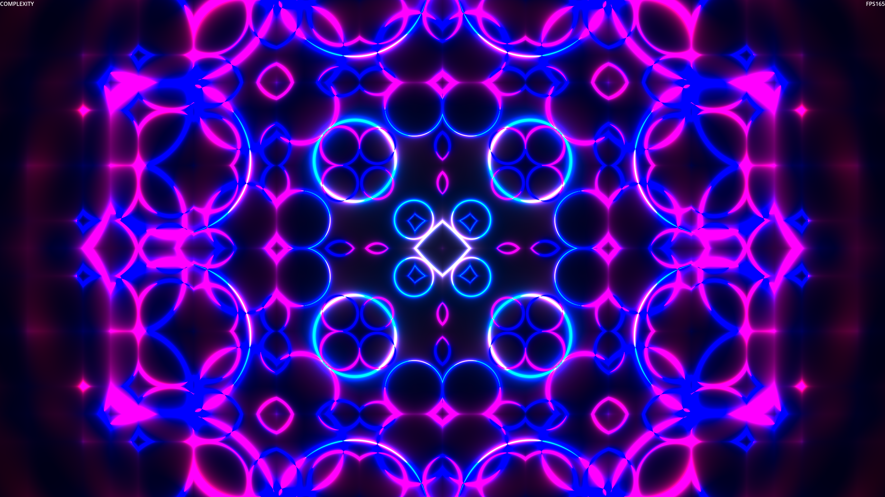

# Shader Toy

Shader toy inspired by [Kichimisu](https://youtu.be/f4s1h2YETNY).  
It is made with the Godot Engine and is interactive.

It is currently deployed on Itch.io [here](https://lucas-linhares.itch.io/pretty-shader-toy).

Controls are simple:

- Select parameters with arrows left and right (← →) or for mobile, swiping left and right on the screen.

- Increase or decrease their value with arrows up and down (↑ ↓) or for mobile, swiping up and down on the screen.
